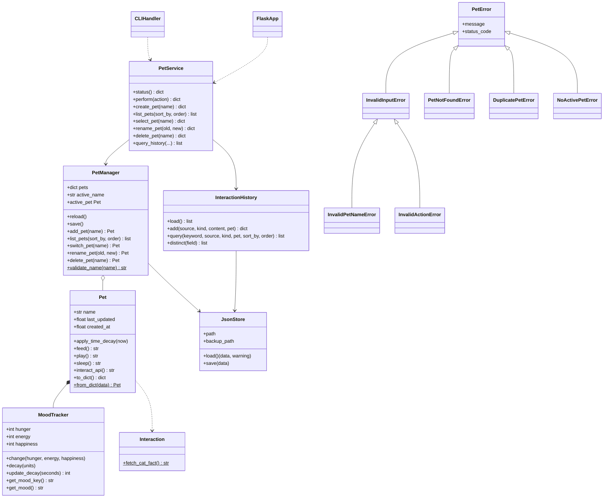

# PLAN.md — Virtual Pet Companion

เอกสารสถาปัตยกรรมรวมของโปรเจกต์ ใช้ร่วมทุก Sprint
รายละเอียดการดำเนินงาน ผลทดสอบ และ retrospective ของแต่ละรอบอยู่ใน `sprints/`

## สมาชิกในทีม
| รหัสนักศึกษา | ชื่อ-นามสกุล | ชื่อเล่น |
| :---: | :--- | :--- |
| 673380594-9 | นางสาวพรีมภัทร ภาวัฒนวคุณ | พรีม |
| 673380596-5 | นางสาวพิชยา สิทธิพันธ์ | เชอร์ |
| 673380598-1 | นางสาวมุกดา บุญประจันทร์ | เอม |

## 1. ปัญหาและคุณค่าของระบบ
ผู้ใช้ต้องการเกมเลี้ยงสัตว์ที่ "มีชีวิต" คือสถานะเปลี่ยนไปตามเวลาจริงแม้ปิดโปรแกรม
เล่นต่อจากเดิมได้ มีสัตว์เลี้ยงหลายตัว และดูย้อนหลังได้ว่าทำอะไรไปบ้าง
ระบบนี้เล่นได้ทั้งทาง CLI และหน้าเว็บ โดยใช้ข้อมูลชุดเดียวกัน

## 2. สถาปัตยกรรม (Separation of Concerns)

```text
 Presentation Layer   src/cli.py + src/main.py (CLI)      web/app.py + web/static/index.html (Web)
                                 \                                  /
 Service Layer                    src/service.py  (PetService — จุดเดียวที่ UI เรียกใช้)
                                 /            |               \
 Business Logic      src/pet.py        src/pet_manager.py     src/history.py (search/filter/sort)
                                              |                                     |
 Data Access                        src/storage.py (JsonStore: atomic write + backup + recovery)
                                              |
 Files                          pets.json / pets_backup.json      interaction_history.json
```

หลักการสำคัญ
- **UI ไม่แตะไฟล์หรือ Pet โดยตรง** ทุกคำสั่งผ่าน `PetService` ทำให้ CLI กับเว็บทำงานเหมือนกันทุกประการ
- **State Consistency** ทุกเมธอดของ `PetService` จะ reload จากไฟล์ก่อน และบันทึกทันทีหลังเปลี่ยนข้อมูล
  และมี lock กันหลาย request เขียนทับกัน
- **Custom Exceptions** ทุก error ของระบบสืบทอดจาก `PetError` UI ดักที่เดียว CLI แสดงข้อความ เว็บแปลงเป็น HTTP status

## 3. UML Class Diagram



## 4. Data Schema

**`pets.json`** (schema version 2 — ยังอ่านไฟล์รูปแบบเดิม (v1) ได้)
```json
{
  "version": 2,
  "active": "Milo",
  "pets": {
    "Milo": {
      "name": "Milo",
      "hunger": 35,
      "energy": 80,
      "happiness": 70,
      "last_updated": 1790000000.0,
      "created_at": 1789990000.0
    }
  }
}
```
- `hunger`, `energy`, `happiness` เป็นจำนวนเต็ม 0–100 (ค่าที่เกินจะถูกบังคับเข้าช่วง)
- ชื่อสัตว์เลี้ยง 1–20 ตัวอักษร ใช้ได้เฉพาะไทย/อังกฤษ ตัวเลข ช่องว่าง `-` `_` และห้ามซ้ำ (ไม่สนตัวพิมพ์)

**`interaction_history.json`** — list ของ entry (เก็บล่าสุดไม่เกิน 5,000 รายการ)
```json
{"timestamp": "2026-09-28T14:05:11", "source": "User", "kind": "feed", "pet": "Milo", "content": "คุณให้อาหาร Milo แล้ว!"}
```
| field | ค่าที่เป็นไปได้ |
|---|---|
| source | `User`, `Cat Facts API`, `System` |
| kind | `feed`, `play`, `sleep`, `fact`, `create`, `rename`|

## 5. กฎของเกม (Business Rules)
| เหตุการณ์ | ผล |
|---|---|
| เวลาผ่านไปทุก 10 วินาที | หิว +5, พลังงาน −3, ความสุข −2 (เศษเวลาเก็บไว้คิดรอบถัดไป) |
| feed | หิว −30, พลังงาน +10 · ปฏิเสธถ้าพลังงาน 0 หรือหิว ≤ 10 |
| play | สุข +25, หิว +15, พลังงาน −20 · ปฏิเสธถ้าหิว ≥ 90 หรือพลังงาน < 20 |
| sleep | พลังงาน = 100, หิว +20 |
| fact | สุข +10 + เกร็ดความรู้จาก Cat Facts API (ออฟไลน์ใช้ข้อมูลสำรอง) |
| อารมณ์ | หิว > 80 → หิวมาก, พลังงาน < 20 → ง่วง, สุข > 70 → มีความสุข, นอกนั้น → อารมณ์ดี |

## 6. Web API
| Method | Path | ใช้ทำ | Error |
|---|---|---|---|
| GET | `/api/pet` | สถานะตัวที่เลี้ยงอยู่ | 409 ยังไม่มีสัตว์เลี้ยง |
| POST | `/api/pet/actions/<action>` | feed / play / sleep / fact | 400 action ผิด |
| POST | `/api/pet/talk` | `{"message": "..."}` คุยกับสัตว์เลี้ยง คืน `reply`, `online`, `pet` | 400 ข้อความว่าง/ยาวเกิน 200, 409 |
| GET | `/api/pets?sort_by=&order=` | รายการสัตว์เลี้ยง (Read) | 400 คีย์เรียงผิด |
| POST | `/api/pets` | `{"name": "..."}` (Create) | 400 ชื่อผิด, 409 ชื่อซ้ำ |
| PUT | `/api/pets/<name>` | `{"new_name": "..."}` (Update) | 404, 400, 409 |
| DELETE | `/api/pets/<name>` | ลบ (Delete) | 404 |
| POST | `/api/pets/<name>/select` | สลับตัวที่เลี้ยง | 404 |
| GET | `/api/history?q=&source=&kind=&pet=&sort_by=&order=&limit=` | ค้นหา/กรอง/เรียง | 400 |

ทุก error ตอบเป็น `{"error": "ข้อความภาษาไทย"}`

## 7. Definition of Done

รายละเอียดเต็มของแต่ละ Sprint อยู่ใน `sprints/sprintX/REPORT.md`

**Sprint 1 — Front-End App Dev**
- [x] โครงสร้าง Modular: `src/cli.py`, `src/pet.py`, `src/main.py`
- [x] Class ตามหลัก OOP: `Pet`, `MoodTracker`, `Interaction`
- [x] แสดงแบนเนอร์ต้อนรับ เมนู และสถานะสัตว์เลี้ยงใน CLI
- [x] รับคำสั่งได้ไม่ว่าพิมพ์เล็กหรือใหญ่ (`.strip().lower()`)
- [x] บันทึกและโหลดสถานะผ่าน `pet_state.json`
- [x] Input ผิด, Ctrl+C, ไม่พบไฟล์ → โปรแกรมไม่ Crash
- [x] CI ด้วย GitHub Actions (pytest + flake8)

**Sprint 2 — Back-End App Dev**
- [x] โหลดข้อมูลจาก JSON และจำตัวที่เลี้ยงล่าสุดได้
- [x] ชื่อไม่มีอยู่ → `PetNotFoundError`, ชื่อผิดรูปแบบ → `InvalidPetNameError`, ชื่อซ้ำ (ไม่สนตัวพิมพ์) → `DuplicatePetError` โดยโปรแกรมไม่พัง
- [x] ไฟล์หาย → เริ่มใหม่, ไฟล์เสีย → กู้จาก backup และซ่อมไฟล์หลัก, ข้อมูลบางตัวเสีย → ข้ามและแจ้งเตือน
- [x] ทุก Interaction ถูกบันทึกพร้อมชื่อสัตว์เลี้ยง ค้นหา/กรอง/เรียงได้หลายคุณลักษณะ
- [x] ค้นหาคำว่างคืนทั้งหมด, เรียงด้วยคีย์ที่ไม่รองรับ → แจ้งตัวเลือกที่ใช้ได้
- [x] ค้นหา + กรอง + เรียง ข้อมูล 1,000 รายการเสร็จภายใน 50 ms

**Sprint 3 — Full-Stack App Dev**
- [x] CLI และเว็บเรียก CRUD ของสัตว์เลี้ยงได้ครบ (เพิ่ม ดู เปลี่ยนชื่อ ลบ สลับ)
- [x] ทั้งสองหน้าเรียกผ่าน `PetService` ตัวเดียว ข้อมูลตรงกันทันที (ทดสอบใน `test_cli_and_web_stay_in_sync`)
- [x] ทุก error จากเว็บตอบเป็น JSON พร้อม HTTP status ที่ถูกต้อง (400 / 404 / 409)
- [x] ลบตัวสุดท้ายแล้วไม่พัง ระบบพาไปสร้างตัวใหม่
- [x] หลาย request พร้อมกันไม่ทำให้ข้อมูลหาย

**Final Sprint — DevOps & AI** (รายละเอียดใน `sprints/sprint-final/REPORT.md`)
- [x] คำสั่ง `talk` ใช้ได้ทั้ง CLI และเว็บ AI รู้สถานะของสัตว์เลี้ยง และบันทึกลงประวัติ
- [x] ไม่มี API key หรือ API ล่ม → ตอบแบบออฟไลน์ ไม่ crash
- [x] GitHub Actions รัน flake8 แบบเต็มและ pytest บน Python 3.10 และ 3.12

## 8. ปัญหาทางเทคนิคและการ Refactor

| Sprint | ประเภท | ปัญหา | วิธีแก้ |
|---|---|---|---|
| 1 | Bug fix | กด Ctrl+C ระหว่างรอ input แล้วเกิด `KeyboardInterrupt` โปรแกรมหลุด | ครอบ `try-except (KeyboardInterrupt, EOFError)` ให้ปิดโปรแกรมอย่างนุ่มนวล |
| 2 | Refactor | เซฟข้อมูลซ้อนกัน 2 ระบบ (`pet_state.json` กับ `pets.json`) | รวมให้เหลือ `PetManager` + `pets.json` |
| 2 | Refactor | `src/interaction.py` (Dog API) ไม่ได้ถูกเรียกใช้ | ลบออก |
| 2 | Refactor | เมธอดคืนข้อความผิดพลาดเป็น string แยกไม่ออกว่าสำเร็จหรือไม่ | เปลี่ยนเป็น Custom Exceptions |
| 2 | Refactor | `web/history.py` เป็น Data/Logic แต่อยู่ในโฟลเดอร์ web | ย้ายเป็น `src/history.py` + `src/storage.py` |
| 2 | Bug fix | decay ปัดเศษวินาทีทิ้ง กดคำสั่งถี่กว่า 10 วินาทีสถานะไม่ลด | เลื่อน `last_updated` ตามหน่วยที่ใช้จริง |
| 2 | Bug fix | ไฟล์ backup ถูกเขียนพร้อมไฟล์หลักเสมอ จึงเหมือนกันทุกครั้ง | backup เก็บเวอร์ชันก่อนหน้า + เขียนแบบ atomic |
| 2 | Bug fix | Flask ไม่อยู่ใน `requirements.txt` ติดตั้งใหม่แล้วรันเว็บไม่ได้ | เพิ่มใน `requirements.txt` |
| 3 | Refactor | `main.py` มี if/elif ที่เรียก history + save ซ้ำทุกคำสั่ง และเว็บจะต้องเขียนซ้ำอีกชุด | แยก `src/service.py` ให้ CLI และเว็บเรียกร่วมกัน |
| 3 | Bug fix | เว็บส่ง request พร้อมกันแล้วข้อมูลหาย (last write wins) | ใส่ lock ใน `PetService` |
| 3 | Bug fix | error บางกรณีตอบเป็นหน้า HTML หน้าเว็บอ่านไม่ได้ | error handler ตอบ JSON ทุกกรณี |
| 3 | Bug fix | ปุ่มเปลี่ยนชื่อ/ลบบนเว็บไม่ทำงานในเบราว์เซอร์ที่บล็อกกล่อง `prompt()`/`confirm()` | แก้ชื่อในแถว และยืนยันการลบบนปุ่มเอง |

| Final | Design | ถ้าเรียก AI ขณะถือ lock request อื่นต้องรอ API นานสุด 10 วินาที | อัปเดตสถานะ+บันทึกใน lock แล้วเรียก AI นอก lock |
| Final | Refactor | CI ตรวจ flake8 เฉพาะ error ร้ายแรง และรันแค่ Python 3.10 | flake8 เต็ม (ไม่รวม snapshot ใน `sprints/`), matrix 3.10/3.12 |

## 9. ทางเลือกที่พิจารณา (Design Decisions)
| เรื่อง | เลือก | ทางเลือกอื่น | เหตุผล |
|---|---|---|---|
| เก็บสัตว์เลี้ยงในหน่วยความจำ | `dict[name, Pet]` | `list[Pet]` | หาตามชื่อได้ O(1) และกันชื่อซ้ำง่าย |
| ที่เก็บข้อมูล | JSON | SQLite, CSV | ข้อมูลเล็ก อ่านได้ด้วยตา ไม่ต้องติดตั้งเพิ่ม · ข้อเสีย: ต้องเขียนทั้งไฟล์ทุกครั้งและต้องจัดการเขียนพร้อมกันเอง |
| การเชื่อม UI กับ Logic | Service Layer (Facade) | ให้ UI เรียก `PetManager` ตรงๆ | กันโค้ดซ้ำระหว่าง CLI กับเว็บ และคุม consistency ได้ที่เดียว |
| การส่งต่อ error | Custom Exceptions | คืนค่า string/None | UI แยกกรณีได้ชัด เว็บแมปเป็น HTTP status ได้ |
| การเรียงลำดับ | `sorted()` + key tuple หลายคีย์ | เขียน sort เอง | Timsort O(n log n) และ stable · 1,000 รายการใช้ ~1 ms |

## 10. โครงสร้างโปรเจกต์
```text
script_project/
├── .github/workflows/ci.yml   flake8 + pytest
├── src/
│   ├── main.py                CLI entry point + คำสั่ง
│   ├── cli.py                 CLIHandler (แสดงผล/รับอินพุต)
│   ├── service.py             PetService (Service Layer)
│   ├── pet.py                 Pet, MoodTracker, Interaction
│   ├── pet_manager.py         PetManager (CRUD สัตว์เลี้ยง)
│   ├── history.py             InteractionHistory + search/filter/sort
│   ├── storage.py             JsonStore
│   └── exceptions.py          Custom Exceptions
├── web/
│   ├── app.py                 Flask API
│   └── static/index.html      หน้าเว็บเกม
├── scripts/benchmark.py       วัดความเร็ว search/filter/sort
├── tests/                     pytest
├── sprints/                   รายงานแต่ละ Sprint
```
